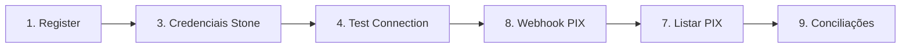

# Guia de testes — ConfiaPix + Postman

Fluxo passo a passo para testar a API localmente com Docker e Postman.

---

## Pré-requisitos

- [Docker Desktop](https://www.docker.com/products/docker-desktop/) instalado e **rodando**
- [Postman](https://www.postman.com/downloads/) instalado
- SecretKey Stone sandbox (`sk_...`) e `account_id` (ex.: `194047458`)

---

## 1. Subir a API (Docker)

Abra o terminal na pasta do projeto:

```powershell
cd "d:\03 - Trabalho\03 - Freelas\FLUXPAY\confiapix"
docker compose up --build -d
```

Aguarde ~30 segundos e confira:

```powershell
docker ps --filter "name=confiapix"
```

Esperado:

| Container            | Status   | Porta |
|----------------------|----------|-------|
| `confiapix-app`      | Up       | 8080  |
| `confiapix-postgres` | healthy  | 5432  |

**Base URL:** `http://localhost:8080`

### Se o Postgres falhar

```powershell
docker compose down -v
docker compose up --build -d
```

---

## 2. Importar coleção no Postman

1. Abra o Postman → **Import**
2. Selecione o arquivo:

   ```
   confiapix/postman/ConfiaPix-Stone-API-KEY.postman_collection.json
   ```

3. A coleção **ConfiaPix - Stone API_KEY (Sandbox)** aparecerá na barra lateral.

---

## 3. Configurar variáveis

Clique na coleção → aba **Variables** → preencha e **Save**:

| Variável         | Valor                      | Descrição                          |
|------------------|----------------------------|------------------------------------|
| `baseUrl`        | `http://localhost:8080`    | URL da API                         |
| `token`          | *(vazio)*                  | Preenchido automaticamente no passo 1 |
| `stoneSecretKey` | `sk_sua_chave_aqui`        | SecretKey Stone sandbox            |
| `stoneAccountId` | `194047458`                | ID da conta Stone                  |

---

## 4. Fluxo de teste (ordem recomendada)

Execute **um request por vez**, de cima para baixo.



| Passo | Request na coleção              | Auth   | Objetivo                          |
|-------|---------------------------------|--------|-----------------------------------|
| 1     | Auth - Registrar tenant         | Não    | Criar tenant + token JWT          |
| 3     | Stone - Salvar credenciais      | Sim    | Gravar `sk_` + account_id         |
| 4     | Stone - Testar conexão          | Sim    | Validar SecretKey na Stone        |
| 8     | Webhook - Simular PIX           | Não    | Importar PIX fake               |
| 7     | PIX - Listar                    | Sim    | Ver PIX importado                 |
| *     | Conciliações (manual, passo 9)  | Sim    | Ver status da conciliação         |

> **Passo 2 (Login)** — só se já registrou antes e não tem token.  
> **Passo 5** — opcional, confere credenciais salvas.  
> **Passo 6 (Sync)** — pode falhar no modo API_KEY; use o passo 8 para testar PIX.

---

## Passo 1 — Registrar tenant

| Campo    | Valor                              |
|----------|------------------------------------|
| Método   | **`POST`** (obrigatório)           |
| URL      | `{{baseUrl}}/auth/register`        |
| Headers  | `Content-Type: application/json` |

**Body (raw JSON):**

> No Postman: aba **Body** → **raw** → selecione **JSON** (não form-data nem none).

```json
{
  "tenantName": "Minha Empresa",
  "name": "Admin",
  "email": "admin@confiapix.test",
  "password": "secret123"
}
```

> Use um e-mail **diferente** se já registrou antes (ex.: `admin2@confiapix.test`).

**Resposta esperada (201):**

```json
{
  "success": true,
  "message": "Registro realizado com sucesso",
  "data": {
    "token": "eyJ...",
    "refreshToken": "...",
    "role": "ADMIN",
    "tenantId": "..."
  }
}
```

O script da coleção salva `data.token` em `{{token}}`.

---

## Passo 2 — Login (opcional)

| Campo   | Valor                         |
|---------|-------------------------------|
| Método  | `POST`                        |
| URL     | `{{baseUrl}}/auth/login`      |

**Body:**

```json
{
  "email": "admin@confiapix.test",
  "password": "secret123"
}
```

---

## Passo 3 — Salvar credenciais Stone (API_KEY)

| Campo   | Valor                                                    |
|---------|----------------------------------------------------------|
| Método  | `PUT`                                                    |
| URL     | `{{baseUrl}}/api/v1/integrations/stone/credentials`      |
| Headers | `Authorization: Bearer {{token}}`                        |
|         | `Content-Type: application/json`                         |
| Role    | `ADMIN`                                                  |

**Body:**

```json
{
  "authMode": "API_KEY",
  "businessModel": "GATEWAY",
  "clientSecret": "{{stoneSecretKey}}",
  "accountId": "{{stoneAccountId}}",
  "merchantId": "{{stoneAccountId}}"
}
```

**Resposta esperada (200):**

```json
{
  "success": true,
  "data": {
    "authMode": "API_KEY",
    "accountId": "194047458",
    "active": true
  }
}
```

> Se o passo 4 falhar, repita com `"businessModel": "SUBACQUIRER"`.

---

## Passo 4 — Testar conexão Stone

| Campo   | Valor                                                       |
|---------|-------------------------------------------------------------|
| Método  | `POST`                                                      |
| URL     | `{{baseUrl}}/api/v1/integrations/stone/test-connection`     |
| Headers | `Authorization: Bearer {{token}}`                           |

**Resposta esperada (sucesso):**

```json
{
  "success": true,
  "data": {
    "authMode": "API_KEY",
    "success": true,
    "httpStatus": 200,
    "message": "Conexão Stone Online OK",
    "endpointTested": "https://payments.stone.com.br/v1/charges?limit=1"
  }
}
```

---

## Passo 5 — Consultar credenciais (opcional)

| Campo   | Valor                                                    |
|---------|----------------------------------------------------------|
| Método  | `GET`                                                    |
| URL     | `{{baseUrl}}/api/v1/integrations/stone/credentials`      |
| Headers | `Authorization: Bearer {{token}}`                        |

---

## Passo 6 — Sync PIX da Stone (opcional)

| Campo   | Valor                                              |
|---------|----------------------------------------------------|
| Método  | `POST`                                             |
| URL     | `{{baseUrl}}/api/v1/integrations/stone/sync`       |
| Headers | `Authorization: Bearer {{token}}`                  |

Pode retornar erro no modo **API_KEY** — isso é esperado se a Stone não liberou Open Banking OAuth. Para testar PIX localmente, use o **passo 8**.

---

## Passo 8 — Simular webhook PIX (teste local)

| Campo   | Valor                                      |
|---------|--------------------------------------------|
| Método  | `POST`                                     |
| URL     | `{{baseUrl}}/api/v1/webhooks/stone/pix`    |
| Headers | `Content-Type: application/json`           |
| Auth    | **Nenhum** (endpoint público)              |

**Body:**

```json
{
  "env": "sandbox",
  "event_type": "pix_inbound_payment_received",
  "id": "evt-postman-1",
  "target_data": {
    "account_id": "194047458",
    "amount": 10000,
    "status": "SETTLED",
    "transaction_id": "TX-POSTMAN-1",
    "end_to_end_id": "EPOSTMAN001",
    "settled_at": "2024-06-10T12:00:00Z"
  }
}
```

> O `account_id` no body deve ser **igual** ao salvo no passo 3.

**Resposta esperada (200):**

```json
{
  "success": true,
  "data": {
    "processed": true,
    "imported": true,
    "txid": "TX-POSTMAN-1"
  }
}
```

---

## Passo 7 — Listar PIX

| Campo   | Valor                                      |
|---------|--------------------------------------------|
| Método  | `GET`                                      |
| URL     | `{{baseUrl}}/api/v1/pix?page=0&size=20`   |
| Headers | `Authorization: Bearer {{token}}`          |

**Resposta esperada:** lista com o PIX `TX-POSTMAN-1` em `data.content`.

---

## Passo 9 — Listar conciliações (manual)

Não está na coleção — crie um request ou use o Swagger.

| Campo   | Valor                                      |
|---------|--------------------------------------------|
| Método  | `GET`                                      |
| URL     | `{{baseUrl}}/api/v1/reconciliations`       |
| Headers | `Authorization: Bearer {{token}}`          |

---

## Fluxo extra — Cobrança + conciliação automática

Para testar conciliação **MATCHED**, crie **empresa**, **cliente** e **cobrança** com o mesmo valor do PIX (R$ 100,00) **antes** do webhook.

### 9a. Criar empresa

`POST {{baseUrl}}/companies` + `Authorization: Bearer {{token}}`

```json
{
  "corporateName": "Empresa Teste LTDA",
  "tradeName": "Empresa Teste",
  "document": "12345678000199"
}
```

Guarde o `id` retornado em `data.id` → variável `companyId`.

### 9b. Criar cliente

`POST {{baseUrl}}/customers` + token

```json
{
  "name": "Cliente Teste",
  "email": "cliente@test.com",
  "document": "12345678901",
  "companyId": "{{companyId}}"
}
```

Guarde o `id` → variável `customerId`.

### 9c. Criar cobrança (R$ 100,00)

`POST {{baseUrl}}/api/v1/receivables` + token

```json
{
  "description": "Cobrança teste Postman",
  "amount": 100.00,
  "dueDate": "2026-12-31",
  "customerId": "{{customerId}}",
  "companyId": "{{companyId}}"
}
```

### 9d. Webhook PIX (passo 8)

Use `"amount": 10000` no body (centavos = R$ 100,00).

### 9e. Consultar conciliações

`GET {{baseUrl}}/api/v1/reconciliations` → status `MATCHED` se valores baterem.

---

## Referência rápida de endpoints

### Públicos

| Método | Endpoint                         |
|--------|----------------------------------|
| POST   | `/auth/register`                 |
| POST   | `/auth/login`                    |
| POST   | `/auth/refresh`                  |
| POST   | `/api/v1/webhooks/stone/pix`     |
| GET    | `/swagger-ui.html`               |

### Autenticados (Bearer token)

| Método | Endpoint                                         | Role              |
|--------|--------------------------------------------------|-------------------|
| PUT    | `/api/v1/integrations/stone/credentials`         | ADMIN             |
| GET    | `/api/v1/integrations/stone/credentials`         | ADMIN             |
| POST   | `/api/v1/integrations/stone/test-connection`     | ADMIN, FINANCIAL  |
| POST   | `/api/v1/integrations/stone/sync`                  | ADMIN, FINANCIAL  |
| GET    | `/api/v1/pix`                                    | ADMIN, FINANCIAL, VIEWER |
| GET    | `/api/v1/pix/{id}`                               | ADMIN, FINANCIAL, VIEWER |
| GET    | `/api/v1/pix/txid/{txid}`                        | ADMIN, FINANCIAL, VIEWER |
| GET    | `/api/v1/reconciliations`                        | ADMIN, FINANCIAL, VIEWER |
| GET    | `/api/v1/reconciliations/{id}`                   | ADMIN, FINANCIAL, VIEWER |
| GET    | `/api/v1/receivables`                            | ADMIN, FINANCIAL, VIEWER |
| POST   | `/api/v1/receivables`                            | ADMIN, FINANCIAL  |

---

## Troubleshooting

| Problema | Solução |
|----------|---------|
| `Connection refused` | `docker compose up -d` |
| `401 Unauthorized` | Rode passo 1 ou 2 de novo |
| `E-mail já cadastrado` | Troque o e-mail no passo 1 ou use o **passo 2 (Login)** |
| `Erro interno do servidor` no passo 1 | Confira: Body → **raw** → **JSON**; header `Content-Type: application/json`; JSON válido com os 4 campos (`tenantName`, `name`, `email`, `password`) |
| `Request method 'GET' is not supported` | O endpoint exige **POST**. No Postman, selecione `POST` (não abra a URL no navegador) |
| Webhook: tenant não encontrado | `account_id` do body ≠ credenciais salvas |
| Passo 4 falha | Tente `businessModel: SUBACQUIRER` |
| Passo 6 falha | Normal no API_KEY; use passo 8 |
| Postgres error | `docker compose down -v` e suba de novo |

---

## Swagger (documentação interativa)

Com a API no ar:

- UI: http://localhost:8080/swagger-ui.html
- JSON: http://localhost:8080/api-docs

---

## Parar a API

```powershell
docker compose down
```

Para apagar dados do banco:

```powershell
docker compose down -v
```
